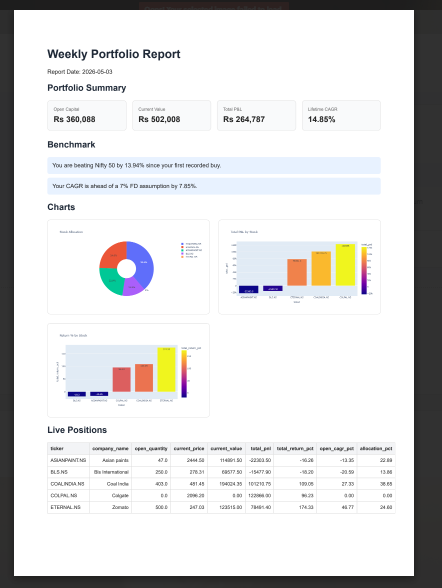
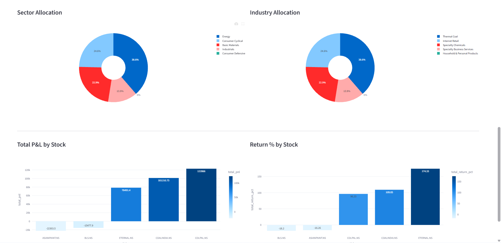
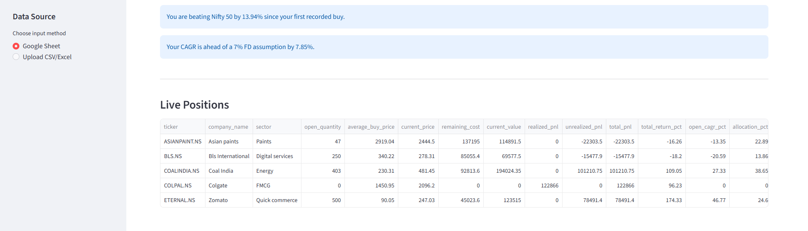
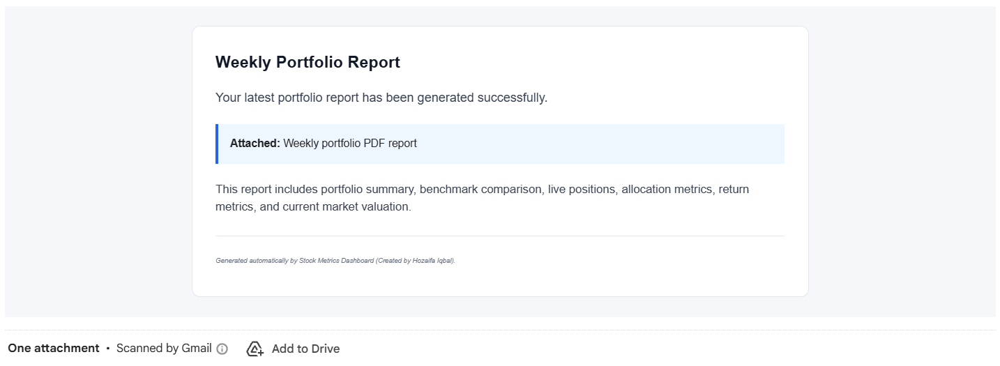

# Stock Metrics Dashboard


A privacy-first portfolio analytics, dashboarding, and reporting system for Indian equity investors.

Stock Metrics Dashboard converts manual portfolio tracking from into an automated analytics system that calculates portfolio performance, fetches live market prices, compares returns with benchmarks, generates dashboards, creates PDF reports, and sends weekly email updates automatically.

### 🎯 The Goal
In a market with over **12cr+ active demat accounts** and **~35 AMCs** competing for Alpha, this tool helps you answer the most critical question: *Where do you stand in the crowd?*

### 📊 Key Insights Delivered
* **Benchmark Alpha:** Did you beat the market indices based on your specific portfolio mix?
* **Currency-Adjusted Returns:** What is your performance when adjusted for INR-USD fluctuations?
* **Capital Efficiency:** A clear picture of your money management effectiveness over time.

---

## Dashboard Preview








---

## What This Project Does

Stock Metrics Dashboard helps investors move from manual spreadsheet tracking to automated portfolio intelligence.

It can:

- Read portfolio transactions from Google Sheets
- Accept uploaded CSV/Excel files from users
- Provide a downloadable Excel template
- Clean and validate raw transaction data
- Track open and closed positions
- Handle partial exits
- Calculate realized and unrealized profit/loss
- Fetch latest market prices
- Calculate current portfolio value
- Calculate lifetime return and CAGR
- Calculate open position return and CAGR
- Compare performance with Nifty 50
- Compare performance with USD-INR movement
- Generate an interactive Streamlit dashboard
- Generate weekly HTML/PDF reports
- Send reports automatically through email
- Run weekly automation using GitHub Actions

---

## Why I Built This

I have been investing in Indian equities for several years and had my buy prices, sell prices, quantities, thesis notes, and portfolio history stored manually in Google Sheets.

This project was built to automate that workflow.

Instead of manually checking every position, updating prices, calculating profits, and preparing summaries, this system turns the portfolio sheet into a live analytics dashboard and weekly reporting engine.

---

## Project Pipeline

```text
Google Sheet / Excel / CSV
        |
        v
Data Ingestion
        |
        v
Data Cleaning and Validation
        |
        v
Portfolio Engine
        |
        v
Live Market Data Fetching
        |
        v
Benchmark Comparison
        |
        v
Streamlit Dashboard
        |
        v
HTML / PDF Report Generation
        |
        v
Email Automation
        |
        v
GitHub Actions Scheduler
```

### Core Features

#### Portfolio Tracking
* Buy and sell transaction tracking
* Broker-wise transaction support
* Open and closed position calculation
* Partial sell handling
* Average buy price calculation
* Holding period calculation
* Realized P&L
* Unrealized P&L
* Total P&L
* Open capital tracking
* Lifetime capital deployed tracking

#### Market Data
* Latest stock price fetching using Yahoo Finance
* Current market value calculation
* Stock-wise return calculation
* Portfolio allocation calculation

#### Benchmarking
* Nifty 50 comparison
* USD-INR comparison
* Fixed deposit return assumption
* Alpha-style benchmark messages

#### Dashboard
* Portfolio summary cards
* Live positions table
* Stock allocation chart
* Sector allocation chart
* Industry allocation chart
* P&L by stock
* Return percentage by stock
* Benchmark comparison section

#### Reporting
* Weekly HTML report
* Weekly PDF report
* Portfolio summary in report
* Benchmark messages
* Position-level report table
* Email delivery with PDF attachment

#### Automation
* GitHub Actions workflow
* Weekly scheduled report
* Manual workflow trigger support
* Secure GitHub Secrets integration

---

## 🛠️ Tech Stack

| Area | Tools Used |
| :--- | :--- |
| **Programming** | Python |
| **Data Handling** | pandas, openpyxl |
| **Market Data** | yfinance |
| **Google Sheets** | gspread, Google Sheets API, Google Cloud Service Account |
| **Dashboard** | Streamlit |
| **Visualization** | Plotly |
| **PDF Generation** | Playwright, Chromium |
| **Email** | Gmail SMTP, email.message |
| **Automation** | GitHub Actions |
| **Secrets** | python-dotenv, GitHub Secrets |
| **Development** | VS Code, Git, GitHub |

## 🛠️ Tech Stack

| Area | Tools Used |
| :--- | :--- |
| **Programming** | Python |
| **Data Handling** | pandas, openpyxl |
| **Market Data** | yfinance |
| **Google Sheets** | gspread, Google Sheets API, Google Cloud Service Account |
| **Dashboard** | Streamlit |
| **Visualization** | Plotly |
| **PDF Generation** | Playwright, Chromium |
| **Email** | Gmail SMTP, email.message |
| **Automation** | GitHub Actions |
| **Secrets** | python-dotenv, GitHub Secrets |
| **Development** | VS Code, Git, GitHub |

## 📂 Folder Structure

```text
stock-metrics-dashboard/
├── app.py
├── README.md
├── requirements.txt
├── .gitignore
├── src/
│   ├── google_sheets.py
│   ├── data_cleaning.py
│   ├── portfolio_engine.py
│   ├── market_data.py
│   ├── benchmark.py
│   ├── stock_metadata.py
│   ├── chart_generator.py
│   ├── report_generator.py
│   ├── email_sender.py
│   ├── run_weekly_report.py
│   └── template_generator.py
├── reports/
│   └── weekly/
├── templates/
├── data/
│   └── sample/
├── assets/
│   ├── dashboard.png
│   ├── report.png
│   └── email.png
└── .github/
    └── workflows/
        └── weekly_report.yml
        
```

## Data Input Format

The project supports two input methods:

### 1. Google Sheet Mode
For personal automation, the project connects directly to a Google Sheet using a service account.

### 2. Upload Mode
For public users, the app provides a downloadable Excel template.

Users can:
1. Download the template
2. Fill their own transaction data locally
3. Upload the file into the dashboard
4. Generate portfolio analytics instantly

This keeps user data private.

## Required Transaction Columns

```text
transaction_id
broker
account_name
ticker
company_name
exchange
sector
transaction_type
transaction_date
quantity
price
gross_amount
charges
net_amount
trade_label
notes
status
position_tag
```

## Example Workflow
```text
1. User enters buy/sell transactions in Google Sheets or Excel.
2. Python reads the data.
3. pandas cleans and validates the data.
4. Portfolio engine calculates holdings and P&L.
5. yfinance fetches latest market prices.
6. Benchmark module compares returns with Nifty 50 and USD-INR.
7. Streamlit displays the dashboard.
8. Report generator creates weekly HTML/PDF reports.
9. Email sender sends the report.
10. GitHub Actions runs the process automatically every week.
```
